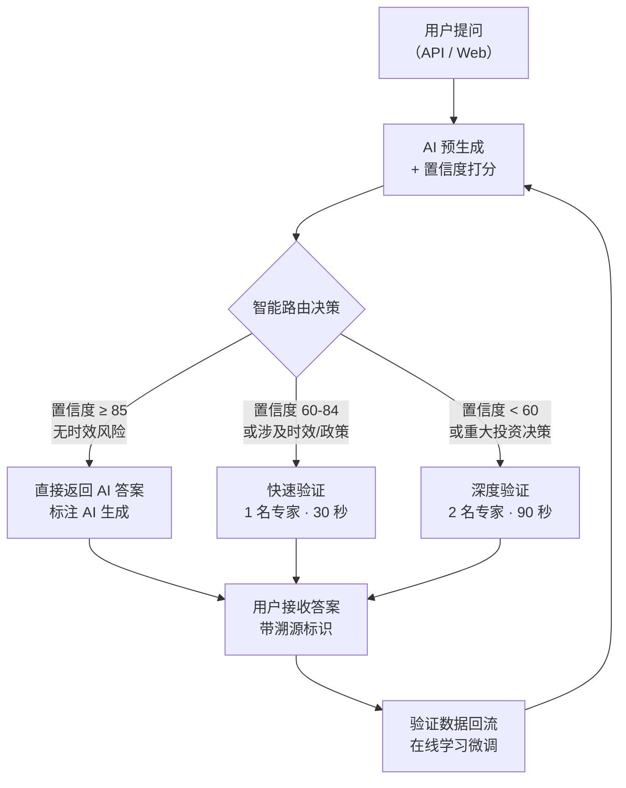

## 1. 产品概述

FinLive 金融智答系统——业界首个「AI 预生成 + 专家秒级验证」双引擎金融问答平台，通过智能路由引擎将大模型效率与人类专家权威深度融合，彻底解决金融领域 AI 回答的时效性、准确性与合规性痛点。

- **核心价值**：AI 提效 80%，专家兜底 100% 准确率，金融级合规可追溯
- **目标用户**：券商、银行、基金公司、投研机构等金融机构及其客户
- **市场定位**：金融垂直领域的「可信 AI 问答基础设施」

---

## 2. 核心功能

### 2.1 用户角色

| 角色 | 接入方式 | 核心价值 |
|------|----------|----------|
| 金融机构 / 终端用户 | API 接入 / Web 界面 | 快速获得准确、可追溯的金融问题答案 |
| AI 引擎 + 路由系统 | 模型服务层 | 智能置信度评估，动态决策是否需要人工介入 |
| 7×24 金融专家网络 | 专家端 App / PC 工作台 | 按需验证、修正、重写，确保答案权威可靠 |

### 2.2 功能模块

1. **Hero 首屏**：产品 slogan、核心价值主张、动态数据展示
2. **三层系统架构**：接入层 → AI 层 → 专家层，可视化展示
3. **核心运行流程**：5 步完整请求链路，动画分步演示
4. **智能路由决策**：置信度分级策略（高/中/低三档）
5. **三方角色详解**：AI 工程师、金融机构、专家各自的操作与收益
6. **收费模式矩阵**：四种场景对应不同计费方式
7. **页脚 CTA**：号召行动，品牌信息

### 2.3 页面详情

| 页面名称 | 模块名称 | 功能描述 |
|----------|----------|----------|
| 首页（单页滚动） | Hero 首屏 | 大标题 + 副标题 + 三大核心数据指标（响应秒级 / 准确率 99%+ / 7×24 覆盖） |
| 首页 | 系统架构 | 三层架构卡片式布局，每层配图标和功能说明 |
| 首页 | 核心流程 | 5 步纵向时间线，悬停高亮，分步动画 |
| 首页 | 智能路由 | 三档置信度对比卡片，差异化视觉权重 |
| 首页 | 三方角色 | Tab 切换 / 三栏布局，各角色操作细节 |
| 首页 | 收费模式 | 四宫格价格卡片，突出核心场景 |
| 首页 | CTA 区域 | 号召文案 + 模拟按钮 + 品牌背书 |

---

## 3. 核心流程

用户提出金融问题 → AI 生成初稿并计算置信度 → 路由引擎智能分级 → 高置信度直接返回 / 中置信度单专家快速验证 / 低置信度双专家深度验证 → 结果带溯源标识返回用户 → 专家修正数据回流模型迭代。

---

## 4. 用户界面设计

### 4.1 设计风格

- **主色调**：深邃藏青 `#0A1628`（金融专业感）+ 金色点缀 `#D4AF37`（高端质感）
- **辅助色**：科技蓝 `#3B82F6`（AI 元素）、翡翠绿 `#10B981`（成功/验证通过）、琥珀橙 `#F59E0B`（警告/待验证）
- **按钮风格**：圆角 12px，渐变填充，悬停微放大 + 发光效果
- **字体**：标题用 `Noto Serif SC`（中文衬线，权威感），正文用 `Inter` / `PingFang SC`（现代易读）
- **布局风格**：深色背景 + 玻璃拟态卡片 + 网格光效背景，营造科技金融氛围
- **图标风格**：Lucide 线性图标，金色描边，填充半透明

### 4.2 页面设计概览

| 页面名称 | 模块名称 | UI 元素 |
|----------|----------|----------|
| 首页 | Hero 首屏 | 全屏深色背景，居中大标题，三数据指标横向排列，底部渐变光效 |
| 首页 | 系统架构 | 三层垂直堆叠卡片，每层左侧图标 + 右侧文字，连接线动画 |
| 首页 | 核心流程 | 左侧时间线圆点 + 右侧内容卡片，滚动触发渐入动画 |
| 首页 | 智能路由 | 三列卡片，中间列（快速验证）略大突出，置信度进度条可视化 |
| 首页 | 三方角色 | 三栏等宽卡片，顶部头像/图标，下方操作细节列表 |
| 首页 | 收费模式 | 2×2 网格卡片，每卡顶部场景图标，中部价格，底部特性列表 |
| 首页 | CTA 区域 | 大字号号召语 + 主按钮 + 辅助按钮，背景径向光效 |

### 4.3 响应式

- 桌面端（≥ 1024px）：多列布局，完整动画效果
- 平板端（768-1023px）：两列布局，间距压缩
- 移动端（< 768px）：单列堆叠，字号适配，简化动画

### 4.4 视觉细节

- 背景：深色底 + 细微噪点纹理 + 网格线叠加 + 径向渐变光晕
- 卡片：玻璃拟态（backdrop-blur），1px 半透明边框，悬停时边框变金色
- 文字：标题金色渐变，正文白色 / 浅灰，数据数字大号加粗
- 动效：滚动渐入（fade-in-up），卡片悬停微上浮，数据计数动画
