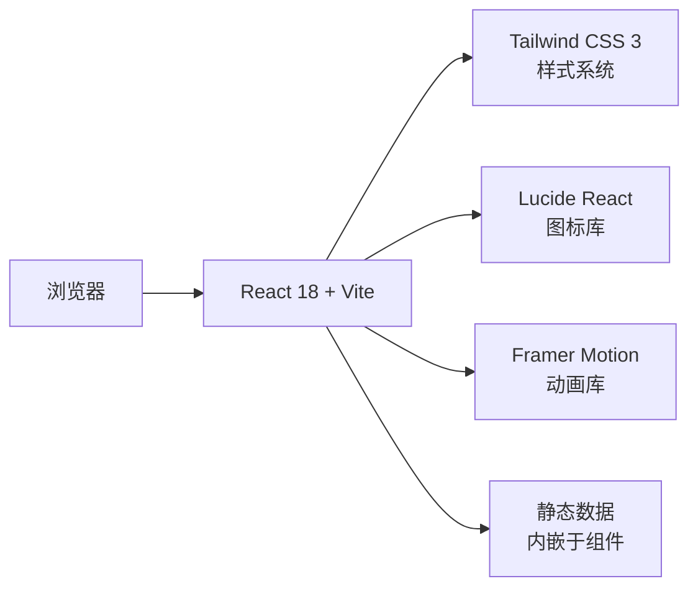

## 1. 架构设计

纯前端单页展示项目，无后端依赖，所有数据静态内嵌。



## 2. 技术描述

- **前端框架**：React 18 + TypeScript
- **构建工具**：Vite 5
- **样式方案**：Tailwind CSS 3
- **状态管理**：无需（纯展示页，组件内 state 即可）
- **图标库**：lucide-react
- **动画方案**：CSS 原生动画 + 少量 framer-motion（如已安装则使用，否则纯 CSS）
- **后端**：无
- **数据库**：无

## 3. 路由定义

| 路由 | 用途 |
|------|------|
| `/` | 首页，单页滚动展示全部内容 |

## 4. 项目结构

```
/workspace
├── src/
│   ├── components/
│   │   ├── Hero.tsx              # 首屏
│   │   ├── SystemArchitecture.tsx # 系统架构
│   │   ├── CoreProcess.tsx       # 核心流程
│   │   ├── SmartRouting.tsx      # 智能路由
│   │   ├── RolesSection.tsx      # 三方角色
│   │   ├── PricingSection.tsx    # 收费模式
│   │   └── FooterCTA.tsx         # CTA 页脚
│   ├── App.tsx
│   ├── main.tsx
│   └── index.css
├── index.html
├── vite.config.ts
├── tailwind.config.js
├── tsconfig.json
└── package.json
```

## 5. 关键技术点

1. **深色主题 + 玻璃拟态**：通过 Tailwind `bg-slate-900/80` + `backdrop-blur-xl` + `border-white/10` 实现
2. **滚动动画**：使用 `Intersection Observer` + CSS transition 实现元素滚动渐入
3. **渐变文字**：`bg-clip-text text-transparent bg-gradient-to-r` 实现金色标题
4. **响应式**：Tailwind 断点系统 `md:` `lg:` `xl:`
5. **性能**：纯静态内容，无网络请求，首屏即达
